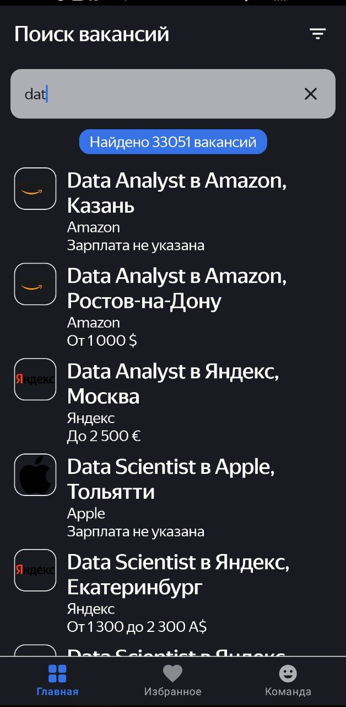
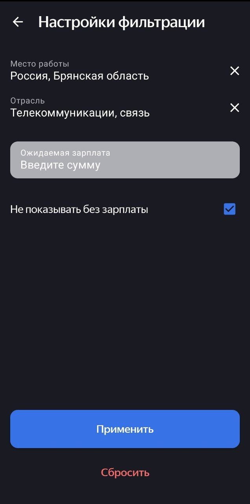
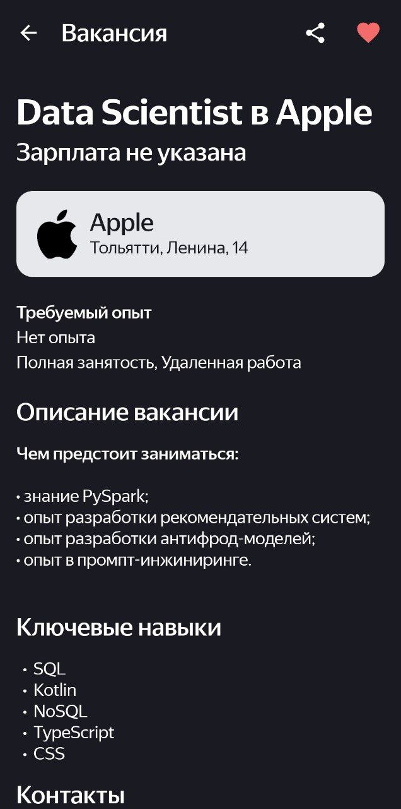

# Job Search App
  

Мобильное приложение для поиска вакансий. 

## 🎵 Оглавление

- [О проекте](#-о-проекте)
- [Функциональности](#-функциональности)
- [Скриншоты](#-скриншоты)
- [Технологии](#-технологии)
- [Установка и запуск](#-установка-и-запуск)
- [Структура проекта](#-структура-проекта)
- [Архитектура](#-архитектура)

## 📱 О проекте

Job Search App - это современное Android-приложение для соискателей, позволяющее:

*   **Искать вакансии** по обширной базе данных
*   **Создавать избранные списки** с понравившимися вакансиями
*   **Фильтровать результаты** по региону, отрасли и зарплате
*   **Просматривать детальную информацию** о вакансиях
*   **Настраивать параметры поиска** для точного подбора
## 🎯 Функциональности

### 🔍 Поиск вакансий
*   Поиск по ключевым словам и профессиям
*   Пагинация результатов
*   Обработка ошибок сети и пустых результатов
*   Индикатор применения фильтров

### ⚙️ Фильтрация
*   Фильтрация по странам и регионам
*   Выбор отрасли деятельности
*   Настройка ожидаемой зарплаты
*   Опция "Показывать только с зарплатой"
*   Сброс и применение фильтров

### ❤️ Избранное
*   Добавление вакансий в избранное
*   Просмотр списка сохраненных вакансий
*   Локальное хранение избранных позиций
*   Удаление из избранного

### 📊 Детали вакансии
*   Полная информация о вакансии
*   Контакты работодателя
*   Зарплатная вилка
*   Требуемый опыт и график работы
*   Описание вакансии и ключевые навыки
*   Кнопки "В избранное" и "Поделиться"

### 🎨 Интерфейс
*   Современный Material Design
*   Адаптивный layout
*   Поддержка различных состояний (загрузка, ошибка, пустой список)
*   Интуитивная навигация

## 🖼️ Скриншоты

| Поиск | Фильтры | Избранное | Детали вакансии |
|-------|---------|-----------|-----------------|
|  |  |  |  |

## 🛠 Технологии

### Языки и платформы
*   **Kotlin** - основной язык программирования
*   **Android SDK** - минимальная версия: API 26 (Android 8.0)
*   **Target SDK** - 36
*   **Kotlin Version** - 2.2.20

### Архитектура и компоненты
*   **ViewBinding** - для безопасного доступа к views
*   **Navigation Component** - для навигации между фрагментами
*   **ViewModel** + **LiveData** - для управления UI-состоянием
*   **Room** - для локального хранения данных
*   **RecyclerView** - для отображения списков

### Сетевые запросы и данные
*   **Retrofit** - для работы с HeadHunter API
*   **Gson** - для парсинга JSON-ответов
*   **Koin** - dependency injection

### UI/UX
*   **Material Design** - современный дизайн
*   **Bottom Navigation** - основная навигация приложения
*   **ConstraintLayout** - для гибких layouts
*   **Glide** - для загрузки изображений

### Асинхронность
*   **Kotlin Coroutines** - для асинхронных операций
*   **AdapterDelegates** - для работы с RecyclerView

## 📦 Установка и запуск

### Предварительные требования
*   Android Studio Giraffe или новее
*   JDK 17
*   Android SDK 36
*   Интернет-соединение для доступа к API

### Инструкция по запуску

1. **Клонируйте репозиторий:**
   ```bash
   git clone https://github.com/YanaKudrinskaya/JobSearch.git
   cd diploma-project
   ```
2. **Настройте API токен:**
    Создайте файл develop.properties в корне проекта:
    ```
    apiAccessToken=your_hh_api_token_here
    ```
    Для полученя token перейдите по ссылке https://practicum-diploma-8bc38133faba.herokuapp.com/login
3. **Соберите проект**
4. **Запустите на эмуляторе или устройстве**

### Конфигурация сборки
   Проект использует современный подход с файлом libs.versions.toml для управления зависимостями.

## 📁 Структура проекта
```text
app/
├── src/main/
│   ├── java/ru/practicum/android/diploma/
│   │   ├── data/
│   │   │   ├── converters/            # Конвертеры
│   │   │   ├── db/                    # Локальная БД
│   │   │   ├── dto/                   # Data Transfer Objects
│   │   │   ├── mappers/               # Мапперы
│   │   │   ├── network/               # Сетевые запросы
│   │   │   ├── repository/            # Репозитории
│   │   │   └── storage/               # SharedPreference
│   │   ├── di/                        # Внедрение зависимостей
│   │   ├── domain/                    # Бизнес-логика
│   │   ├── presentation/              # View-models
│   │   ├── ui/                        # Фрагменты и активити
│   │   └── util/                      # Вспомогательные классы
│   │   │   └── App.kt                  # Application класс
│   ├── res/
│   │   ├── layout/                    # XML layouts
│   │   │   ├── fragment_search.xml
│   │   │   ├── fragment_filtering_settings.xml
│   │   │   ├── fragment_workplace_choice.xml
│   │   │   ├── fragment_country_choice.xml
│   │   │   ├── fragment_region_choice.xml
│   │   │   ├── fragment_industry_choice.xml
│   │   │   ├── fragment_favorite.xml
│   │   │   ├── fragment_vacancy.xml
│   │   │   └── activity_root.xml
│   │   ├── values/                    # Ресурсы
│   │   └── navigation/                # Навигационный граф
└── build.gradle.kts                   # Конфигурация сборки
```

## 🏗 Архитектура
Проект следует принципам Clean Architecture и MVVM:
```text
    UI Layer (Fragments/Views)
             ↑
    ViewModel (UI State Management)
             ↑
    Domain Layer (Use Cases, Models)
             ↑
    Data Layer (Repositories)
             ↑
    Local (Room) ←→ Remote (Retrofit + API)
```
### Описание слоев:
*   **UI Layer:** Фрагменты, активити, кастомные вью, адаптеры
*   **ViewModel:** Управление состоянием UI, обработка событий пользователя
*   **Domain Layer:** Бизнес-логика, interactors, domain модели
*   **Data Layer:** Репозитории, координация источников данных
*   **Local:** Room Database для локального хранения избранного
*   **Remote:** Retrofit + API для сетевых запросов

⭐ Поставьте звезду репозиторию, если проект вам понравился!


